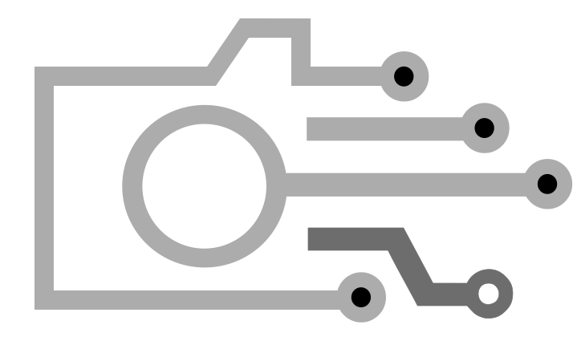

<div align="center">

[](https://github.com/AdrianCert/snap4frame)
### **S N A P 4 F R A M E**

[](https://pypi.org/project/snap4frame/)
[](https://pypi.org/project/snap4frame/)
[](https://github.com/astral-sh/ruff)
[](https://mypy-lang.org/)
[](https://github.com/pre-commit/pre-commit)
[](https://pypi.org/project/snap4frame/)

[](https://sonarcloud.io/summary/new_code?id=AdrianCert_snap4frame)
[](https://sonarcloud.io/summary/new_code?id=AdrianCert_snap4frame)
[](https://sonarcloud.io/summary/new_code?id=AdrianCert_snap4frame)
<!-- [](https://sonarcloud.io/summary/new_code?id=AdrianCert_snap4frame) -->
[](https://sonarcloud.io/summary/new_code?id=AdrianCert_snap4frame)

[](#)
[](#)

<!-- TODO add other badges on readme once information is available -->

</div>

### Instantly capture, analyze, and debug your python code, even in production

This package lets you capture detailed insights, including variables for call stack frames, at any moment or when exceptions occur, helping you trace and resolve issues more efficiently.

## Getting started

snap4frame requires Python 3.8 or later. To install the latest or upgrade to the latest version of snap4frame, run the following command:

```sh
pip install snap4frame
```

### Usage

Here's a basic example of how to use snap4frame:

```python
import snap4frame

snap4frame.init()
```

## Contributing

We welcome contributions to snap4frame! Please see our [contributing guide](CONTRIBUTING.md) for more details.

## License

Snap4frame is licensed under the [MIT License](license.md).
